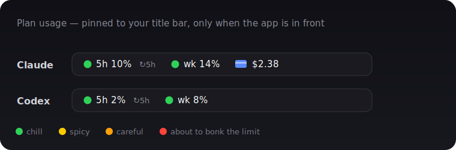

# Claude + Codex Usage Bar 📊

**A tiny macOS bar that shows how much of your Claude and Codex plan you've burned — pinned right onto the app window, so you stop alt-tabbing into Settings 47 times a day.**



> *"Can I send one more message, or will it bonk the limit mid-thought?"* — you, daily, until now.

```
Claude   🟢 5h 10% ↻5h   🟢 wk 14%   💳 $2.38
Codex    🟢 5h 2%  ↻5h   🟢 wk 8%
```

It floats at the top-right of the **Claude** and **Codex** desktop windows, follows them across Spaces and monitors, and quietly tells you:

- **5h** — your 5-hour session limit used
- **wk** — your weekly limit used
- **↻** — when the current session resets (counts down: `↻24m`)
- **💳** — Claude extra-usage spend (Codex has no bills — lucky you)

🟢 chill → 🟡 spicy → 🟠 careful → 🔴 living dangerously

## Install (macOS)

**Quick:**

```bash
curl -fsSL https://raw.githubusercontent.com/niyubuilds/did-i-hit-the-limit/main/install.sh | bash
```

**Or clone first** (recommended — it touches your login, so feel free to read it before running):

```bash
git clone https://github.com/niyubuilds/did-i-hit-the-limit.git
cd did-i-hit-the-limit
./install.sh
```

One keychain tap on first run (your own login), then it lives in your title bar forever and auto-starts at login. **Drag** to move it, **right-click** to quit. No Python? `brew install python`.

## Who this is for

You pay for **Claude Pro/Max** or **ChatGPT/Codex**, you use the desktop apps, and you're tired of *guessing* how close you are to the rate limit. You do **not** need to be a deep-in-the-weeds dev — it's one copy-paste command.

## FAQ (a.k.a. what you actually searched for)

- **How do I see my Claude usage limit on a Mac?** → This. Live 5-hour + weekly usage, right on the Claude window.
- **When does my Claude / Codex 5-hour limit reset?** → The `↻` countdown on the bar.
- **Is there a Claude usage tracker / rate-limit monitor?** → You found it.
- **Does it work for Codex / the ChatGPT plan too?** → Yep, same bar, its own window.
- **Can I see my Claude Code token usage?** → Hover the Claude bar.

## Is it safe? (yes — here's exactly why)

It reads the **same data the apps already show you**, using **your own logged-in session**, and talks **only** to Anthropic's and OpenAI's own servers:

- **Claude** → decrypts the `claude.ai` cookies the app stores (via your macOS keychain) → calls `claude.ai/api/.../usage`
- **Codex** → reads the token in `~/.codex/auth.json` → calls `chatgpt.com/backend-api/wham/usage`

No telemetry, no third-party servers, no sign-up. It's a few hundred lines of readable Python — skim it before you run it. Your keychain key is cached locally (`chmod 600`) and never leaves your Mac.

## Uninstall

```bash
./uninstall.sh
```

## Caveats

- **macOS only** (uses AppKit + CoreGraphics).
- Uses the apps' **internal/undocumented** usage endpoints, so it may need a small update if Anthropic/OpenAI change them. It is **read-only** — it never sends a message or spends a cent.

---

<sub>Keywords: Claude usage bar · Claude Pro / Max usage monitor · Claude rate limit tracker · Claude 5-hour limit · Claude weekly limit reset · Codex usage · ChatGPT plan limit · OpenAI Codex rate limit · Anthropic usage indicator · macOS menu/title-bar usage overlay · Claude Code token usage · "how much of my Claude plan have I used". MIT licensed · built for people who just want the number.</sub>
